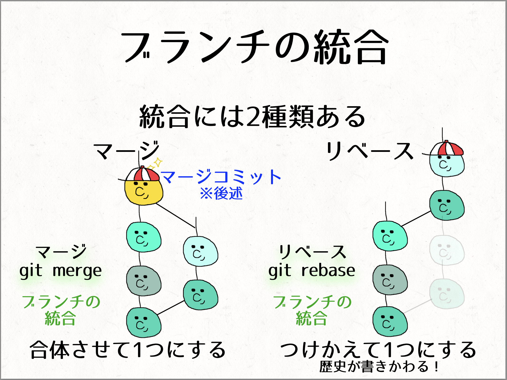

# gitの基本的な操作

## 目次
1. Git と Git Hub について
2. Git と Git Hub のインストール方法について
3. Git 操作について
   1. Git 操作の流れについて
   2. ローカルでの操作について
   3. リモートでの操作について
   4. ブランチの操作について
4. 参考資料

# 1. Git と Git Hub について

複数人でプロジェクトを管理するにあたり、便利なものがあります。
それが、Git と Git Hub です。
これらは、プロジェクトを時系列的に木構造でプロジェクトを管理できるようにします。
詳しくは、次以降で述べます。

## **Git** とは？
**Git**（ギット）は、分散型バージョン管理システムです。

### **特徴**
- **バージョン管理**  
  ソースコードやファイルの変更履歴を記録し、いつでも過去のバージョンに戻せる仕組みです。
- **分散型**  
  リポジトリ（コードや変更履歴を保存する場所）を複数のコンピュータに分散して管理できます。
- **ローカル操作**  
  ネットワークに接続しなくても、ローカルでほとんどの操作が可能です。
- **軽量**  
  差分管理が効率的に行われ、変更履歴のデータサイズが小さく保たれます。

### **よく使うGitの用語**
- **リポジトリ**：ファイルとその変更履歴を保存する場所。
- **コミット（commit）**：変更内容をリポジトリに保存する操作。
- **ブランチ（branch）**：メインの開発から分岐して作業する独立した領域。
- **マージ（merge）**：ブランチで行った変更を統合する操作。
- **プッシュ（push）**：ローカルの変更をリモートリポジトリに送る操作。
- **プル（pull）**：リモートリポジトリの変更をローカルに取り込む操作。
- **クローン（clone）**：リモートリポジトリをローカルにコピーする操作。

## **GitHub** とは？
**GitHub**（ギットハブ）は、Gitリポジトリをホスティング（保存・共有）するためのWebサービスです。

### **特徴**
- **リモートリポジトリのホスト**  
  Gitで管理しているプロジェクトをインターネット上で保存し、共有できます。
- **コラボレーション**  
  チームでの共同開発が容易になります。変更の提案やレビューを行う機能があります。
- **公開・非公開リポジトリ**  
  プロジェクトを公開してオープンソース化したり、非公開で開発することもできます。
- **Pull Request（プルリクエスト）**  
  変更内容を提案して、他の開発者にレビューしてもらう仕組みです。
- **Issue（イシュー）**  
  タスクやバグ、要望などを管理する機能です。
- **CI/CD機能**  
  GitHub Actionsを使って、コードのテストやデプロイの自動化を設定できます。


## **Git と Git Hub を使用する簡単な流れ**  
1. **Git**を使ってローカルでファイルの変更履歴を管理。  
2. **GitHub**にリモートリポジトリを作成して、変更内容をプッシュ。  
3. チームメンバーはリモートリポジトリから変更をプルし、共同で開発。


Gitはバージョン管理のためのシステムであり、GitHubはそれを共有・管理するためのオンラインプラットフォームです。
両方を組み合わせることで、効率的なソフトウェア開発が可能になります！


# Git と Git Hub のインストール方法

# Git 操作について

## Git 操作の流れについて

- git操作で使うもの
    
    リモートリポジトリ・・・サーバにあるリポジトリ、チーム開発なら複数人で共有する
    
    ローカルリポジトリ・・・自分のリポジトリ、基本的に自分しか触らない
    
    ワークツリー・・・gitで管理するファイルを操作・編集する場所
    

- gitの操作の流れ

  

上記のフローをgit用語(コマンド)と一緒に理解しよう！

## ローカルでの操作について

初めに、ローカルリポジトリ作成には2つの方法がある。

- 1つ目は、すでに使いたいgitリポジトリが存在する場合。以下のコマンドを使う。

    例）https://github.com/xxxxxxxxxx/xxxxxxxxx.git から clone する場合
    ```
    $ git clone https://github.com/xxxxxxxxxx/xxxxxxxxx.git
    ```

- 2つ目は、gitリポジトリを新規作成する場合。以下のコマンドを使う。

    ```
    $ git init
    ```

これらによって、.gitという隠しフォルダができる。

※ 1つ目の方法の方が、初心者には扱いやすいです。

詳しい操作は、以下の画像でまとめてあります。

  

```
$ git reset
```

コミット対象から除外

```
$ git checkout
```

コミット済みのものを除いた時の、1番最新のコミットした時のワークツリーの状態を取得

<補足>

```
$ git status
```

ローカルの変更の状態を確認できる

## リモートでの操作について

リモートリポジトリとローカルリポジトリとの間で行う操作は、以下にまとめてあります。

```
$ git push
```

リモートリポジトリからローカルリポジトリに操作の情報を送る

```
$ git fetch
```

リモートリポジトリからローカルリポジトリに変更を反映

```
$ git merge
```

ローカルリポジトリからワークツリーに変更を反映

```
$ git pull
```

リモートリポジトリからワークツリーに一気に変更を反映

  

## ブランチの操作について

これまでは、ローカルとリモートの基本操作について、説明してきました。
さて、Git管理では、プロジェクトを木構造で管理すると最初に説明しました。
ここでは、Git で木構造で管理する方法について説明します。

まずは、これまでの操作を一つにまとめたものを以下に示します。

  

これを見ると、木構造が何か全くわからないかと思います。
これは、木構造において、各枝における操作に注目してきたからです。


ブランチは、リポジトリ内にコミット(歴史の記録)が溜まっていく中で、時系列的にかつ鎖状に連なっていきます。
そのため、ある場所から枝（ブランチ）を生やしてあげることで、枝分かれを可能にします。
また、ブランチはどの地点からでも作成できます。

つまり、それぞれのブランチの中で並行して開発を進めることで、複数人による同時開発を行うことができます。

### ブランチの作成・ブランチの切り替え

ブランチの作成には、以下のコマンドを使います。

例）hogehogeブランチを作成する場合
```
$ git branch hogehoge
```

  

作業中のブランチを「**HEAD**」と呼びます。

適宜**HEAD**の位置を変えて操作します。

例）hogehoge2ブランチに作業しているブランチを切り替える場合
```
▶️ git checkout hogehoge2
```

### ブランチの結合

複数作ったブランチは時が来たら統合してあげましょう！

統合方法は、以下の２つがあります。
- マージ
- リベース 

今回は、マージ の方をマスターしよう！

git rebase もやってみたいという人は、ここでは触れないので自分で調べてみてください。

  

**注意**  
同じ箇所の編集同士をマージしようとしてもgitではどちらが正しいかを判断できないため、**コンフリクト**が起きます。  
コンフリクトした場合は、人の判断で編集を残します。  
コンフリクトしていない箇所は、自動的にマージされます。  

そういえば、「checkout」が2回出てきたと思います。  
１つ目は、コミット済みのものをローカルリポジトリから、ワークツリーに取り込む時。  
２つ目は、ブランチの切り替えの時です。  
このままでは、「checkout」の役割が多いため、役割分担をしたものを以下に示します。  

どちらを使っても大丈夫です。開発チームに通じる方を使いましょう。  

  


# 参考資料
• [JJUGナイトセミナー「今だから聞きたいGit/GitHub入門」](https://www.youtube.com/watch?v=XRDCyAHffHE)